# CalcX: Calculator & Converter App

An all-in-one offline calculator and converter application built with Flutter, designed for students, engineers, developers, and everyday users. It consolidates mathematical tools, scientific utilities, physics calculators, statistics tools, computer science converters, and unit conversion systems into a single organized platform.

   
  
    

---

## Mockups

| **Home** | **Scientific Calculator** | **Formula Guide** |
| :---: | :---: | :---: |
| 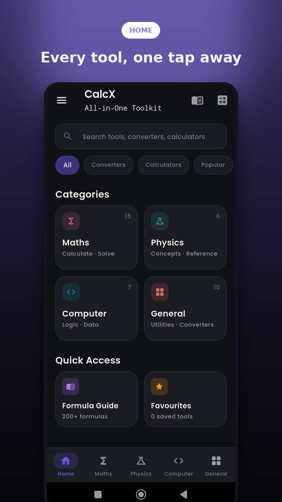 | 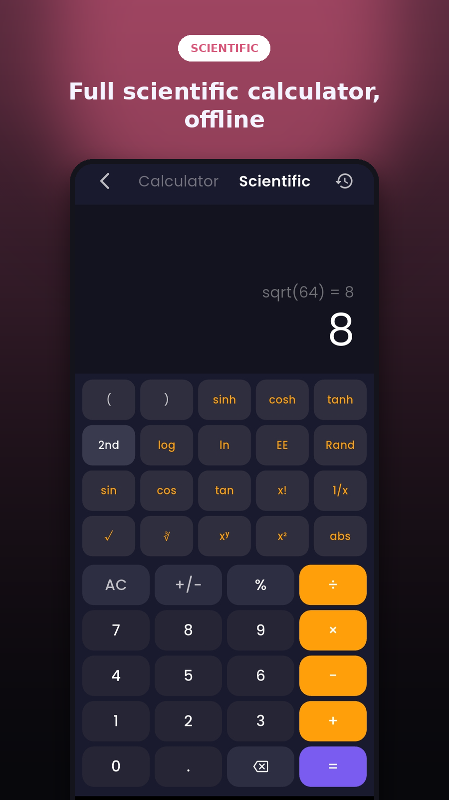 | 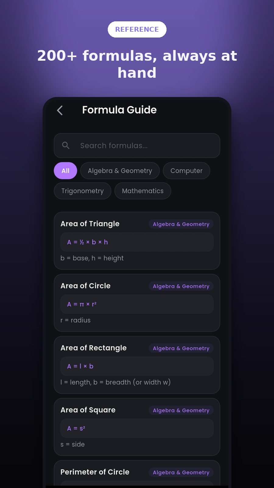 |
| **Periodic Table** | **Matrices** | **Favourites** |
| 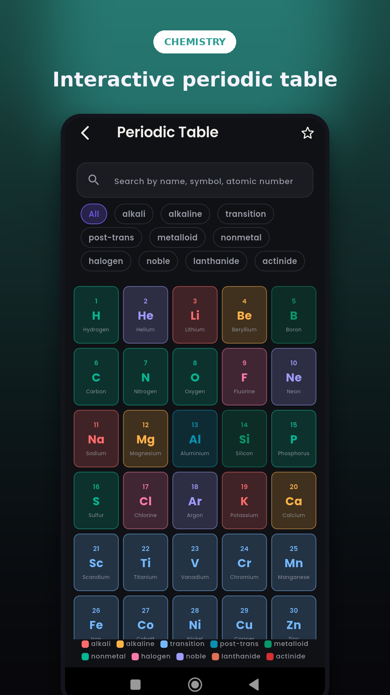 | 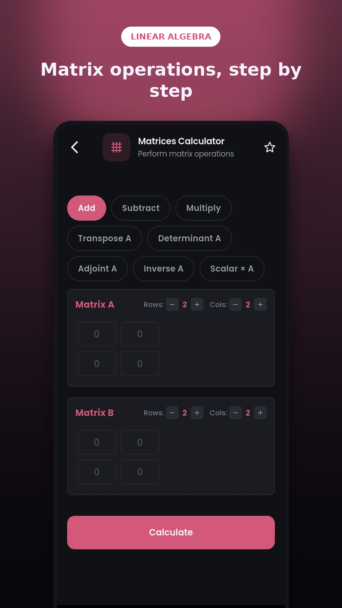 | 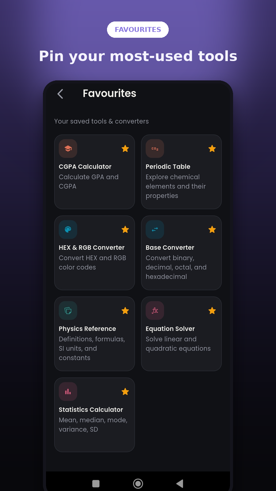 |
| **History** | **Mathematics** | **Computer Science** |
| 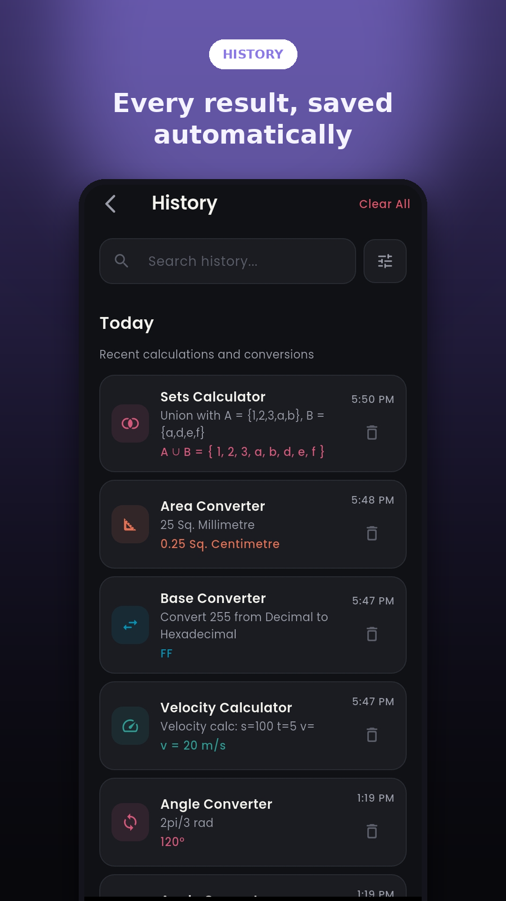 | 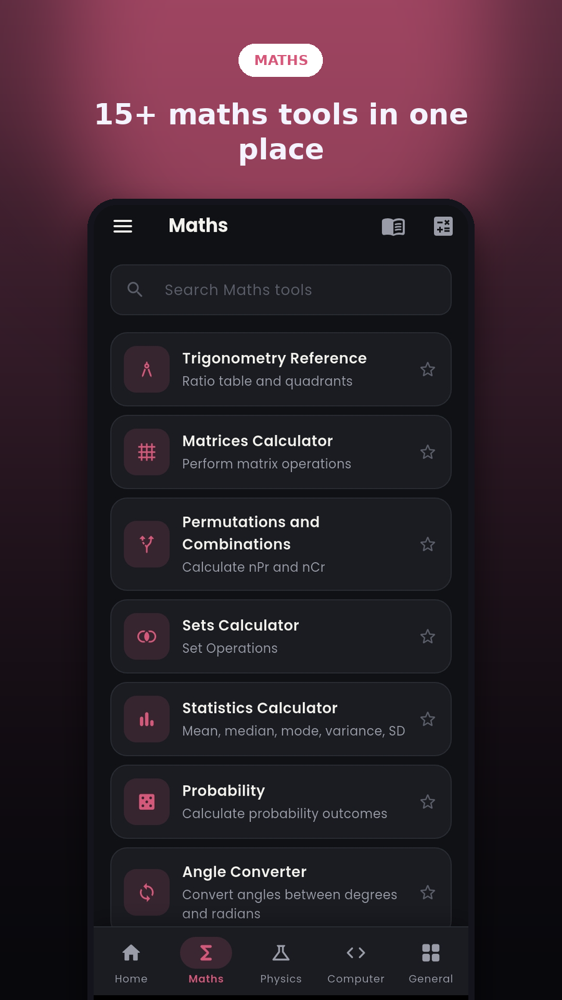 | 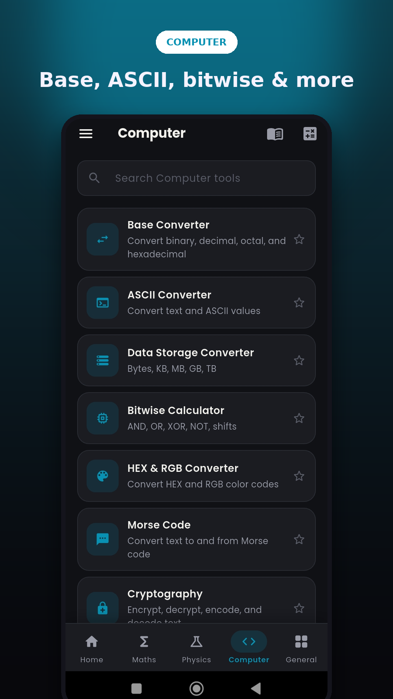 |
| **Physics** | **General Tools** | **Step-by-Step Solutions** |
| 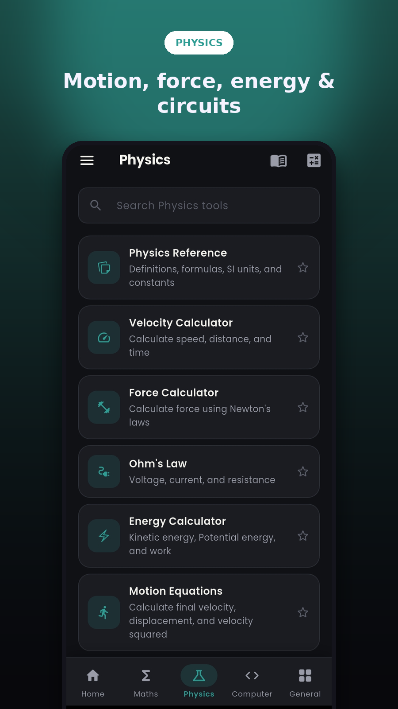 | 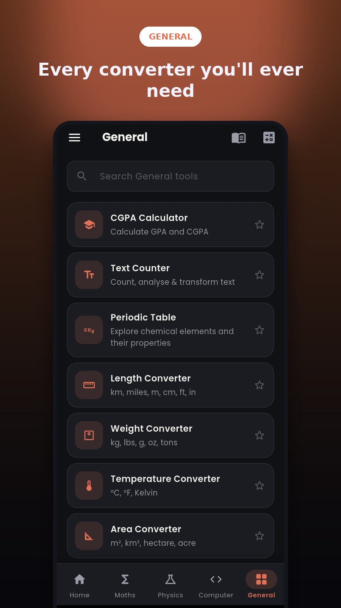 | 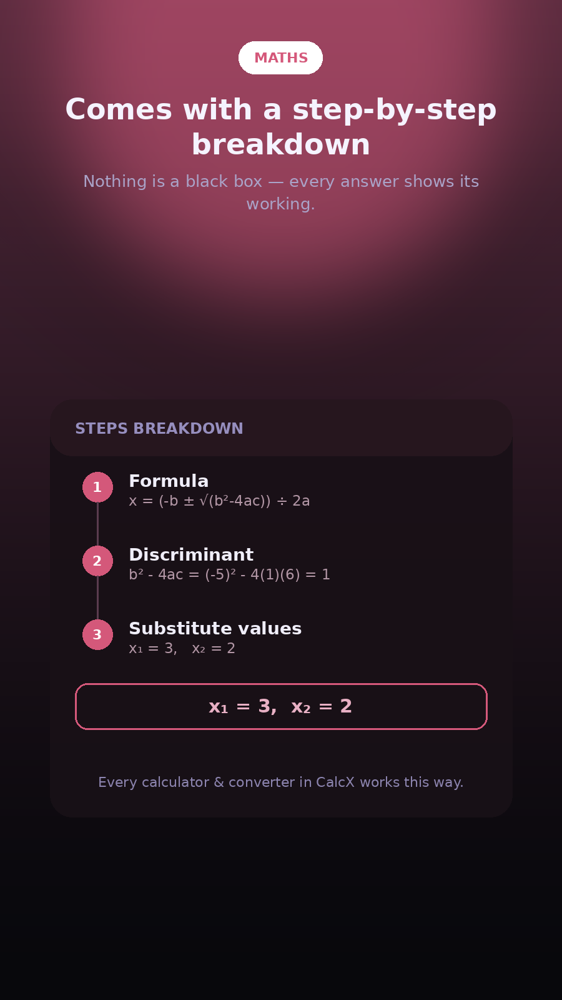 |

---

## Overview

It is designed around a simple principle: users should not need to download multiple separate apps for common academic and engineering tasks. The application works entirely offline, stores all history and preferences locally on device, and provides step-by-step breakdowns for mathematical tools to support learning.

---

## Features

- Fully offline — no internet connection required
- Standard and scientific calculator with history logging
- Formula Guide with 200+ formulas
- Step-by-step solution breakdowns for all math tools
- Favourites system to save frequently used tools
- Calculation history with grouped timeline view
- Search across all tools from the home screen
- Dark and light theme with persistent preference
- Swipe navigation between categories
- Responsive layout for phones and tablets
- Poppins typeface throughout

---

## Tool Categories

### Mathematics
- LCM and HCF Calculator
- Matrices
- Sets
- Trigonometry
- Roman and Decimal Converter
- Percentage Calculator (three modes: X% of Y, X out of Y, percentage change)
- Prime Number Checker
- Equation Solver (linear and quadratic)
- Fraction Calculator (add, subtract, multiply, divide)
- Statistics Calculator (mean, median, mode, variance, standard deviation, range)
- Probability Calculator
- Permutations & Statistics
- Ratio
- Interest
- Angle Converter(radian and degree)

### Physics
- Velocity Calculator (find speed, distance, or time)
- Force Calculator (Newton's second law)
- Ohm's Law (find voltage, current, or resistance)
- Energy Calculator (kinetic and potential energy)
- Motion Equations (SUVAT)
- Physics Reference Sheet - Formulas, definitions, constants, SI units & dimensions

### Computer Science
- Base Converter (decimal, binary, octal, hexadecimal)
- ASCII Converter (character to code and code to character)
- Data Storage Converter (bit through petabyte)
- Bitwise Calculator (AND, OR, XOR, NOT, bit shifts)
- Cryptography
- Mose Converter

### General
- Length Converter
- Weight Converter
- Temperature Converter (Celsius, Fahrenheit, Kelvin)
- Area Converter
- Speed Converter
- Periodic Table
- Age Calculator
- Text Counter & Transform
- CGPA Calculator (multi-semester with grade dropdown)
- BMI Calculator (metric and imperial)

### Calculator
- Standard calculator with expression history
- Scientific calculator with trigonometric, logarithmic, hyperbolic, and algebraic functions
- 2nd shift for inverse functions (sin⁻¹, cos⁻¹, tan⁻¹, sinh⁻¹, cosh⁻¹, tanh⁻¹, log₂, eˣ, 10ˣ)

---

## Tech Stack

| Layer | Technology |
|---|---|
| Framework | Flutter |
| Language | Dart |
| State Management | Flutter Riverpod |
| Local Storage | Hive + Hive Flutter |
| Navigation | go_router |
| Typography | Poppins (self-hosted) |
| Utilities | math_expressions, uuid, intl |
| Code Generation | build_runner, hive_generator, riverpod_generator |

---

## About this repo

This repo showcases the app's architecture — a select set of structural files (entry point, router, and a sample model) are included to demonstrate real, working code. The full implementation remains private.

---

## Built By

**Sabiha Niaz** — Flutter Developer
[LinkedIn](https://www.linkedin.com/in/sabiha-niaz-864771383/) · [GitHub](https://github.com/sabihaniaz7)

*Developed as part of an Android Developer internship at [NexAppra](https://www.nexappra.com/).*
